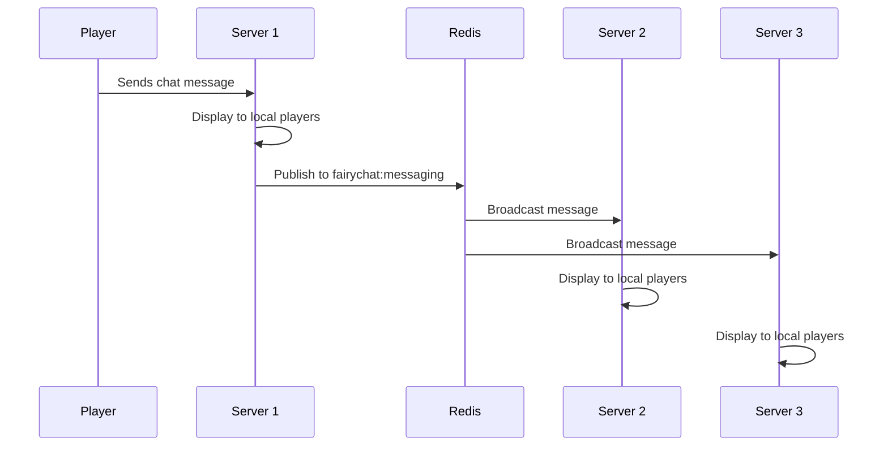

FairyChat uses Redis Pub/Sub to synchronize messages across all servers in your network. When Redis is enabled, chat messages, broadcasts, and other events are automatically distributed to all connected servers.

## How It Works

FairyChat uses a publisher-subscriber pattern with Redis channels:

1. **Publishing** - When an event occurs (chat message, broadcast, etc.), the server publishes it to a Redis channel
2. **Subscribing** - All servers listen to these channels for incoming messages
3. **Processing** - When a message is received, it's processed and displayed to players on that server

<Note>
  Messages are only processed from other servers. Each server ignores its own published messages to prevent duplicates.
</Note>

## Redis Channels

FairyChat uses the following Redis channels for different message types:

### Chat Messages

**Channel:** `fairychat:messaging`

**Purpose:** Synchronizes player chat messages across all servers

**Behavior:**
- When a player sends a chat message, it's published to this channel
- All other servers receive the message and display it to their players
- Respects player ignore lists (ignored players' messages are filtered out)
- Applies mention detection on each server independently
- Can be toggled to display in console via `display-chat-in-console` config option

**Reference:** `PlayerChatMessageSubscriber.java:30`

### Broadcast Messages

**Channel:** `fairychat:broadcast`

**Purpose:** Distributes broadcast messages to all servers

**Behavior:**
- When `/broadcast` or similar commands are used, the message is published
- All servers display the broadcast to their online players
- No filtering applied - all players receive broadcast messages

**Reference:** `BroadcastChannelSubscriber.java:22`

### Private Messages

**Channel:** `fairychat:private_messaging`

**Purpose:** Routes private messages between players on different servers

**Behavior:**
- Allows players to send private messages to players on other servers
- Messages are delivered to the specific recipient regardless of which server they're on

### User Ignore Updates

**Channel:** `fairychat:user-ignore-update`

**Purpose:** Synchronizes player ignore lists across servers

**Behavior:**
- When a player ignores or unignores another player, the change is broadcasted
- All servers update their cached ignore lists
- Ensures consistent ignore behavior network-wide

### Custom Messages

**Channel:** `fairychat:custom-message`

**Purpose:** Distributes custom formatted messages across servers

**Behavior:**
- Used for plugin-specific custom messages
- Allows developers to send custom formatted content network-wide

### Chat Clear

**Channel:** `fairychat:clear-chat`

**Purpose:** Synchronizes chat clear commands across all servers

**Behavior:**
- When a moderator clears chat, it's cleared on all servers simultaneously
- Ensures consistent moderation actions network-wide

## Message Flow

Here's what happens when a player sends a chat message in a multi-server setup:

## Connection Reliability

FairyChat implements automatic reconnection for Redis:

- If the connection to Redis is lost, FairyChat automatically attempts to reconnect
- Reconnection attempts occur every 2 seconds
- When reconnection succeeds, you'll see a log message: `Redis connection re-established [channel]`
- During disconnection, messages are only visible on the local server

**Reference:** `RedisConnector.java:84-107`

## Message Filtering

### Origin Filtering

Each server has a unique identity. When processing messages from Redis, servers check if the message originated from themselves and skip processing to avoid duplicates.

**Reference:** `PlayerChatMessageSubscriber.java:31`

### Ignore List Filtering

When displaying cross-server chat messages:

1. The message is received from Redis
2. Each server checks local player ignore lists
3. If a player has ignored the sender, the message is not shown to that player
4. Other players on the same server still see the message

**Reference:** `PlayerChatMessageSubscriber.java:32-35`

## Performance Considerations

<AccordionGroup>
  <Accordion title="Message serialization">
    Messages are serialized to JSON using Gson before being published to Redis. This is efficient for small to medium-sized networks but consider message volume for very large networks.
  </Accordion>

  <Accordion title="Asynchronous processing">
    All Redis operations (publishing and subscribing) are handled asynchronously to prevent blocking the main server thread. This ensures chat performance remains smooth.
    
    **Reference:** `RedisConnector.java:84` and `RedisConnector.java:130`
  </Accordion>

  <Accordion title="Connection pooling">
    FairyChat uses JedisPool for efficient connection management. Connections are reused and properly closed after each operation.
    
    **Reference:** `RedisConnector.java:54`
  </Accordion>
</AccordionGroup>

## Disabling Redis

If you need to disable Redis:

1. Set `enabled: false` in `redis-credentials`
2. Restart the server
3. Chat will continue working but only on the local server
4. Cross-server features will be unavailable

<Warning>
  When Redis is disabled, players on different servers cannot see each other's messages or communicate via private messages.
</Warning>

## Next Steps

<CardGroup cols={2}>
  <Card title="Redis Setup" icon="database" href="/cross-server/redis-setup">
    Configure Redis connection settings
  </Card>
  <Card title="Private Messages" icon="envelope" href="/features/private-messaging">
    Learn about cross-server private messaging
  </Card>
</CardGroup>